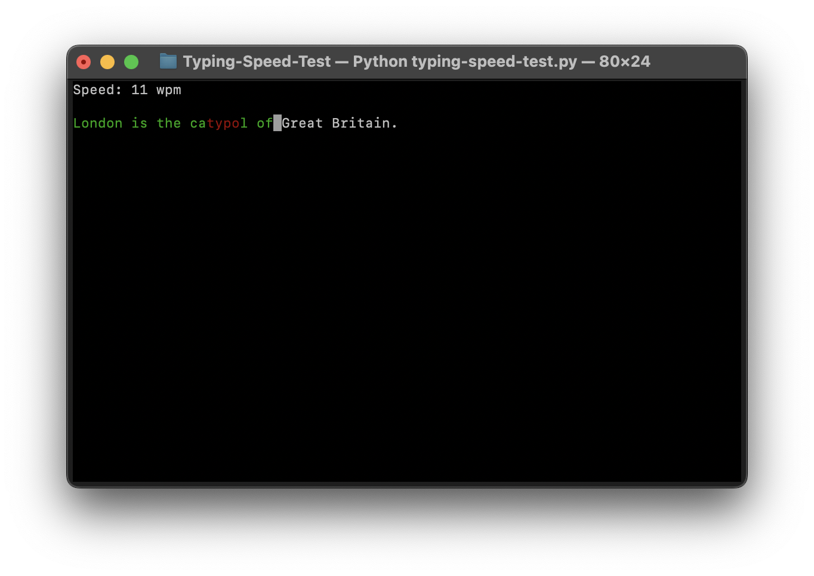

# Typing Speed Test



## Description

A terminal-based typing speed test written in Python. The program provides the Words Per Minute (WPM) result after completing the test.

## Wiki

WPM stands for Words Per Minute.

This metric is used to measure how fast someone can type. Specifically, it indicates the number of “standard words” typed in one minute.

A “standard word” is defined as any 5 characters (including spaces and punctuation).

## Features

* Randomly chooses typing phrases for practice
* Displays real-time speed in Words Per Minute (WPM)
* Supports backspace to correct typing mistakes
* Allows users to quit the test anytime by pressing the Escape key
* After completing the test, the program will display the results

## Requirements

* Python 3.x
* The `curses` library (pre-installed on macOS and Linux)

## Code formatting

This project uses [Black](https://github.com/psf/black) for code formatting with pre-commit hooks.

## How to clone?

Use the following command to clone the repository:

```
git clone <repository url>
```

## How to run?

Navigate to the created directory and run the following command:

```
python typing-speed-test.py
```
